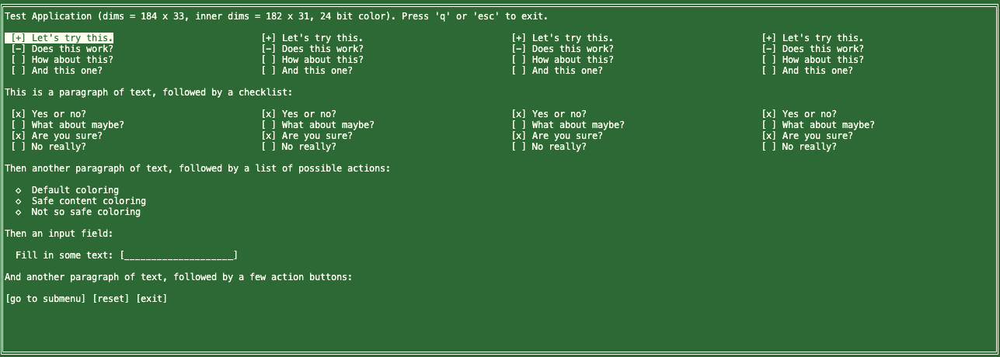

# A Simple TTY UI library

For when you just need a simple terminal-based way to interact with your Node.js code

## How to use this

Create a `Page`, and then add stuff to that. Anything you add automatically gets positioned so that there's empty lines between subsequent page elements, and both text elements and lists (action items, checkboxes, and filter options) automatically reflow. Text will auto-wrap if it can't fit on one line, and lists will spread their items over multiple columns if the page would otherwise be too large to fit on the screen.

Have a look at the `createMenu` function in the below example for the hopefully obvious syntax, or the "api" section after that for the more boring details.

## Example



From the `demo.js` file:

```javascript
import util from "node:util";
import { Components, Colors, Screen, exit, setup } from "./index.js";
const { ActionList, ButtonGroup, CheckboxList, FilterList, Page, Text } =
  Components;

// Some colors, for doing a full menu recolor
const colors = {
  default: [`Default coloring`, [255, 255, 240], [20, 120, 55]],
  safe: [`Safe content coloring`, [255, 255, 240], [20, 55, 120]],
  danger: [`Not so safe coloring`, [255, 255, 240], [120, 55, 55]],
};

/**
 * Create our first (and currently only) page!
 */
async function createMenu() {
  const menu = new Page("main page");

  // some general information
  const { bits } = Colors;
  const { rows, columns, innerWidth, innerHeight } = Screen;
  menu.add(
    new Text(`
        Test Application (dims = ${columns} x ${rows}, inner dims = ${innerWidth} x ${innerHeight}, ${bits} bit color).
        Press 'q' or 'esc' to exit.
      `),
  );

  // A filter list, with "yes/no/ignore" options:
  const selection = menu.add(new FilterList(`filters`));
  const test = 4;
  for (let i = 0; i < test; i++) {
    selection.add(`Let's try this.`, { checked: true });
    selection.add(`Does this work?`, { checked: false });
    selection.add(`How about this?`);
    selection.add(`And this one?`);
  }

  menu.add(new Text(`This is a paragraph of text, followed by a checklist:`));

  // A checkbox list, with "yes/no" options:
  const checks = menu.add(new CheckboxList(`checks`));
  for (let i = 0; i < test; i++) {
    checks.add(`Yes or no?`, { checked: true });
    checks.add(`What about maybe?`);
    checks.add(`Are you sure?`, { checked: true });
    checks.add(`No really?`);
  }

  menu.add(
    new Text(
      `Then another paragraph of text, followed by a list of possible actions:`,
    ),
  );

  // An action list, where each option "does something"
  const actions = menu.add(new ActionList(`actions`));
  Object.values(colors).forEach(([text, ...profile]) => {
    actions.add(text, { onClick: () => setColorProfile(profile) });
  });

  menu.add(
    new Text(
      `And another paragraph of text, followed by a "reset" and "exit" button:`,
    ),
  );

  // And a handy little button group
  const buttons = menu.add(new ButtonGroup(`buttons`));
  buttons.add(`reset`, {
    onClick: async () => await draw(false),
  });
  buttons.add(`exit`, { onClick: () => exit() });

  // Then we return this page
  return menu;
}

/**
 * Helper function to set global colors.
 */
async function setColorProfile(profile) {
  await Colors.setColors(...profile);
  await draw();
}

/**
 * Fully draw our menus. This only gets called sparingly.
 */
async function draw(redraw = true) {
  if (!redraw) {
    // If this is our first draw, set up default colors
    const [text, fg, bg] = colors.default;
    await Colors.setColors(fg, bg);
  }
  await Screen.clear();
  if (!redraw) {
    // And if this is our first draw, create our
    // menu and then select the first selectable.
    await Page.setCurrentPage(await createMenu());
    await Page.current.select();
  }
  Page.current.draw();
}

// let's start our terminal app
await setup(draw);
```

## API

### `Page`

Models a single page in your menu system. Define as many as you want, and simply `.draw()` the one that needs to be shown.

```js
import { Components } from "simple-tty-ui";
const { Page } = Components;
const page = new Page("page name");
```

#### properties

- `.height` height in character rows
- `.width` width in character columns

#### methods

- `.draw()` draw this page to the screen
- `.reflow()` ensure all content fits on the page
- `.select()` selects the first selectable thing on this page. If called as `.select(true)`, selects the _last_ selectable thing instead.
- `.unselect()` does the obvious
- `.toggle()` trigger whichever element is currently selected.
- `.previous()` select whichever selectable element precedes the current on. This behaviour wraps.
- `.next()` select whichever selectable element follows the current on. This behaviour wraps.
- `.add(item)` add an item to this page. returns the added item for convenience.

### Text

```js
import { Components } from "simple-tty-ui";
const { Page, Text } = Components;
const page = new Page("page name");
page.add(new Text("some text"));
```

### Button

Like text, but it can do something!

```js
import { Components } from "simple-tty-ui";
const { Page, Button } = Components;
const page = new Page("page name");
page.add(
  new Button("some text", {
    onClick: () => doSomething(),
  }),
);
```

This will render as `[some text]` on the screen to make it obvious that it's a button.

### ButtonGroup

A group of buttons all on the same line.

```js
import { Components } from "simple-tty-ui";
const { Page, ButtonGroup } = Components;
const page = new Page("page name");
const buttons = page.add(new ButtonGroup());
buttons.add("some text", {
  onClick: () => doSomething(),
});
buttons.add("other text", {
  onClick: () => doSomethingElse(),
});
```

### ActionList

A list of items that act list buttons.

```js
import { Components } from "simple-tty-ui";
const { Page, ActionList } = Components;
const page = new Page("page name");
const actions = page.add(new ActionList("list name here"));
actions.add(`Do a thing`, {
  onClick: (name) => doAThing(name),
});
actions.add(`Do another thing`, {
  onClick: (name) => doAnotherThing(name),
});
```

The click handler gets passed the name of the list item in case you need to switch based on that name.

### CheckboxList

A list of, surprise, checkbox items. These can be either "true" or "false".

```js
import { Components } from "simple-tty-ui";
const { Page, CheckboxList } = Components;
const page = new Page("page name");
const options = page.add(new CheckboxList("list name here"));
function handleOption(name, value) { ... }
options.add(`Do a thing`, { checked: true, onClick: handleOption });
options.add(`Do another thing`, { onClick: handleOption });
```

Chechbox items have a name and optional object with:

- `checked: bool`, the initial "checked or not" state. defaults to false.
- `onClick`, a handle for when this option changes state, with `(name, value)` signature.

### FilterList

A list of filter options, e.g. tristate "true", "false", and "undefined" items, useful for when you need both positive _and_ negative signals.

```js
import { Components } from "simple-tty-ui";
const { Page, FilterList } = Components;
const page = new Page("page name");
const options = page.add(new FilterList("list name here"));
function updateContent(name, value) { ... }
options.add(`Some tag`, { checked: true, onClick: updateContent });
options.add(`Some other tag`, { checked: false, onClick: updateContent });
options.add(`And a third one`, { onClick: updateContent });
```

Filter items behave the same as checkbox items, except their `checked` property has three possible values, `true` for positive, `false` for negative, and `undefined ` (the default) for neither.

### Doing Color Stuff

Colors are handled via the `Colors` object.

```js
import { Colors } from "simple-tty-ui";
```

This object has `setColors(fb, bg)`, `setColor(fg)` and `setBackground(bg)` functions for setting a new color before writing text to the terminal, but what those functions do and the format for the foreground and background colors depend entirely on what color depth the terminal uses, which can be checked using `Colors.bits`. This will either be 3, 4, 8, or 24.

#### 3 bit color

the classic 8 color palette.

| value | color    |
| ----- | -------- |
| 0     | Black    |
| 1     | Red      |
| 2     | Green    |
| 3     | Brown    |
| 4     | Blue     |
| 5     | Purple   |
| 6     | Teal     |
| 7     | Whiteish |

#### 4 bit color

The classic 8 colors, now with a bright/bold/light version!

| value | color   |
| ----- | ------- |
| 8     | Grey    |
| 9     | Red     |
| 10    | Green   |
| 11    | Yellow  |
| 12    | Blue    |
| 13    | Magenta |
| 14    | Cyan    |
| 15    | White   |

You can either use the color code you want, or you can use the lower codes only with a boolean to trigger whether to add 8 or not:

- `setColors(fg, bg, fgBrightOrNot, bgBrightOrNot)`
- `setColor(fg, brightOrNot)`
- `setBackground(bg, brightOrNot)`

#### 8 bit color

A delightfully insane combo-mode that allows for either 4 bit color, an RGB value in a 5x5x5 color cube, or one of 24 levels of grey.

For 4 bit color behaviour, simply call the color functions in the same way as for 4 bit color.

For grayscale, call them with array inputs with gray level 0-23 as first value, and `true` as second value.

For "RGB" colors, call them with [r,g,b] arrays. This will use _the nearest cube LUT_ color, which will look approximately like what you thought you were asking for, but will almost certainly not be the _exact_ color you asked for.

#### 24 bit color

For exact colors, only 24 bit color terminals will do what you want. You call the functions with [r,g,b] array inputs.

## This library is still 0.x

It works, it does what I need, but there's still a bunch of code that's "more work than it should be" if you just need some menu pages so the API and default behaviour is still likely to change until I lock this as a v1 and walk away from it because "it just does what it needs to do and will never need to do more than that".

## What's with the node warning?

Update to Node 26 or later and you won't get it anymore. You can suppress it on older versions of Node by using `node --no-warnings blah.js`.

## Contact

If you find bugs or have ideas, hit up the issue tracker. For everything else, feel free to contact me [on Mastodon](https://mastodon.social/@TheRealPomax).
